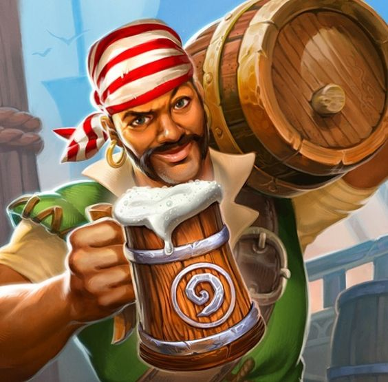

 

  

  <h3 align="center">Bob o Bot</h3>

<!-- Tabela de conteudos -->

  
Tabela de conteudos

  <ol>
    <li>
      <a href="#sobre-o-projeto">Sobre o projeto</a>
      <ul>
        <li><a href="#feito-com">Feito com</a></li>
      </ul>
    </li>
    <li><a href="#licença">Licença</a></li>
    <li><a href="#contato">Contato</a></li>
  </ol>

## Sobre o projeto

[![Product Name Screen Shot][product-screenshot]](https://bob-bot-lake.vercel.app/)

Bob o Bot é um bot do <a class="icon-link" href="https://discord.com/">Discord</a> inspirado no carismático <a class="icon-link" href="https://hearthstone.fandom.com/wiki/Bartender_Bob">Bob</a> do jogo <a class="icon-link" href="https://hearthstone.blizzard.com/pt-br">Hearthstone</a>.  
Feito com o framework de desenvolvimento de bots [Pycord][Pycord-url] e compativel com slash commands. Caso você queira conferir o bot, acesse o [site][Site] e adicione ao seu servidor.

### Feito com

O projeto está sendo desenvolvido com essas tecnologias.

* [![Discord][Discord]][Discord-url]
* [![Python][Python]][Python-url]
* [![Pycord][Pycord]][Pycord-url]
* [![Bootstrap][Bootstrap]][Bootstrap-url]
* [![HTML][HTML]][HTML-url]
* [![CSS][CSS]][CSS-url]
* [![Javascript][Javascript]][Javascript-url]
* [![Vercel][Vercel]][Vercel-url]

## Licença

Distribuido sobre a Licença MIT. Veja `LICENSE` para mais informções.

<!-- CONTACT -->
## Contato
Feito por <a class="icon-link" href="https://github.com/carlosneto726" target="_blank" rel="noopener noreferrer">@carlosneto726</a> & <a class="icon-link" href="https://github.com/JulianoSchaurich" target="_blank" rel="noopener noreferrer">@JulianoSchaurich</a>

<!-- MARKDOWN LINKS & IMAGES -->

[product-screenshot]: images/perfil_example.png

[site]: https://bob-bot-lake.vercel.app/

[Discord]: https://img.shields.io/badge/Discord-7289DA?style=for-the-badge&logo=discord&logoColor=white
[Discord-url]: https://discord.com/

[Python]: https://img.shields.io/badge/Python-3776AB?style=for-the-badge&logo=python&logoColor=white
[Python-url]: https://python.org/

[Pycord]: https://img.shields.io/badge/Pycord-131416?style=for-the-badge&logo=python&logoColor=5A67F2
[Pycord-url]: https://docs.pycord.dev/en/stable/

[Bootstrap]: https://img.shields.io/badge/Bootstrap-563D7C?style=for-the-badge&logo=bootstrap&logoColor=white
[Bootstrap-url]: https://laravel.com/

[HTML]: https://img.shields.io/badge/HTML5-E34F26?style=for-the-badge&logo=html5&logoColor=white
[HTML-url]: https://pt.wikipedia.org/wiki/HTML

[CSS]: https://img.shields.io/badge/CSS3-1572B6?style=for-the-badge&logo=css3&logoColor=white
[CSS-url]: https://pt.wikipedia.org/wiki/Cascading_Style_Sheets

[Javascript]: https://img.shields.io/badge/JavaScript-F7DF1E?style=for-the-badge&logo=javascript&logoColor=black
[Javascript-url]: https://pt.wikipedia.org/wiki/JavaScript

[Vercel]: https://img.shields.io/badge/Vercel-000000?style=for-the-badge&logo=vercel&logoColor=white
[Vercel-url]: https://vercel.com

